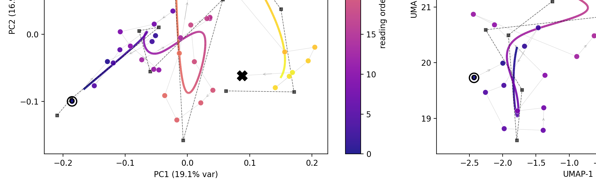
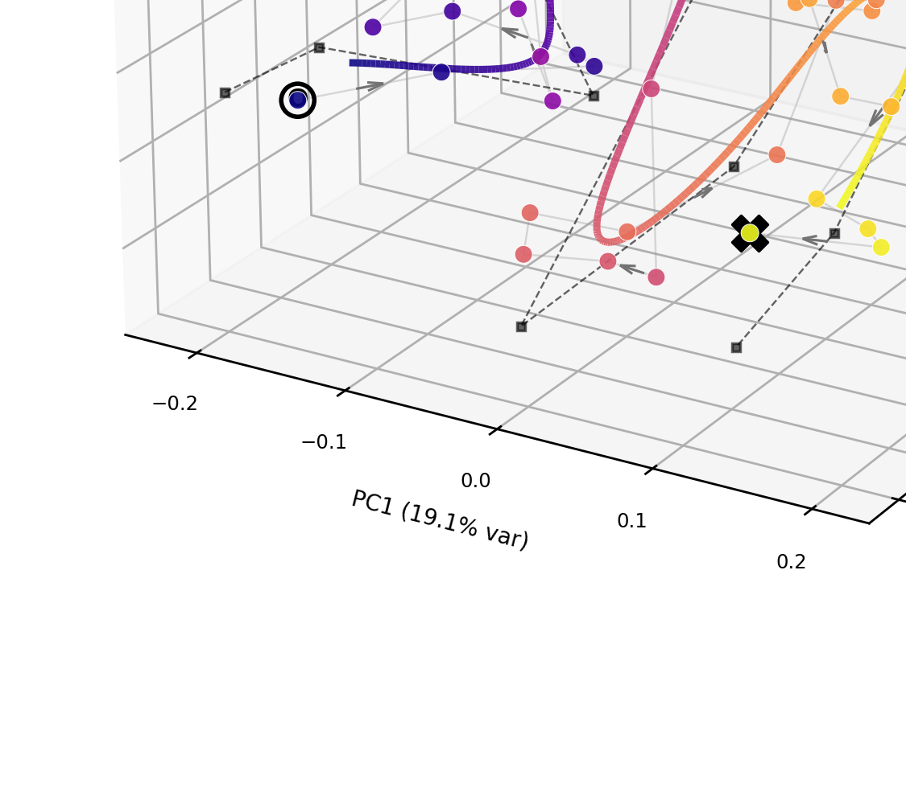

# Narrative Arc

Trace a book's path through embedding space. Slide a window over its paragraphs,
average the embeddings in each window, project the windows to 2-D or 3-D with
**PCA, UMAP and t-SNE**, and connect them in reading order. The resulting line is
the story's trajectory: where it opens (**O**), where it ends (**X**), and the
loops and drifts in between (arrows show direction).



## Method

1. **Windowing.** Row *i* of `embeddings.npy` is paragraph *i*, so window *k* is
   the mean of paragraphs `[k*stride, k*stride + size)`. The default is 40
   paragraphs stepping by 20: wide enough that a window is a scene rather than a
   remark, and half-overlapping so the series moves smoothly. A last window is
   pinned to the end so the closing paragraphs are never dropped.
2. **Projection.** The pooled series is projected three ways, because no single
   projection is trustworthy on its own — *agreement across them is the signal*.
3. **Drawing.** Windows are joined in reading order, colored by progression,
   chapter, dominant emotion or any single emotion score.
4. **Curve fitting** (`--fit`). A uniform B-spline is fitted through the windows
   with [bspline-regression](https://github.com/rstebbing/bspline-regression),
   which works in any dimension, so the 2-D and 3-D arcs use the same fitter. It
   jointly optimises the control points and each window's position on the curve,
   minimising squared distance to the windows plus `λ` × squared distance between
   adjacent control points (damped Newton or Levenberg–Marquardt). The solver
   starts from reading order: each window is placed along the curve in order, and
   the control points are sampled from the path itself. This keeps a path that
   crosses itself from merging its two passes. Each run prints whether the
   solver converged and how many consecutive windows ended up out of order on the
   curve.

   A uniform B-spline is **not clamped**, so the curve starts near the opening
   window and ends near the last one, not exactly on O and X. More control points
   or a smaller `--lambda` bring the ends closer.

### 2-D vs 3-D

The 3-D arc keeps a third component instead of discarding it. Two windows that
overlap in the plane only because the flattening removed what separated them come
apart again, so an apparent crossing can turn out to pass above itself.



How much of the shape to trust depends on the projection:

| | axes | what is signal |
|---|---|---|
| **PCA** | directions of maximal variance (% shown on each axis) | distances and shape, within the variance captured |
| **UMAP** | arbitrary | which windows are neighbours — not distances, angles or overall shape |
| **t-SNE** | arbitrary | neighbourhoods only, even more so than UMAP |

t-SNE needs many more points than perplexity. With ~40 windows and the default
perplexity of 30, the 3-D t-SNE layout is mostly noise — lower `--perplexity`
(e.g. 5–10) or use a smaller `--stride` to get more windows.

## Install

```bash
pip install -r requirements.txt
```

Python ≥ 3.9.

## Data

Books go under `data/` (or anywhere, via `--data-dir`):

```
data/
  <book>/
    processed.json              {"paragraphs": [{"id", "chapter_id", "text", ...}],
                                 "chapters":   [{"chapter_id", "title", ...}]}
    paragraph_scores.json       [{"paragraph_id", "scores": {"wonder": 0.3, ...}}]  (optional)
    embeddings/
      <model>/embeddings.npy    (n_paragraphs, dim), row i = paragraph i
```

The repository ships **Alice's Adventures in Wonderland** (Project Gutenberg)
with `bge-m3` embeddings and per-paragraph emotion scores
(wonder, danger, sadness, humor, confusion, curiosity), so everything below runs
out of the box. Without `paragraph_scores.json` only `--color progression` and
`--color chapter` are available.

## Usage

```bash
# 2-D: PCA, UMAP, t-SNE, colored by reading order and chapter
python arc_2d.py

# 3-D: static PNGs + rotatable HTML
python arc_3d.py

# more coloring, and a fitted B-spline with its control polygon
python arc_2d.py --color progression chapter dominant --fit
python arc_3d.py --color progression dominant emotions --fit --show-control

# a looser or tighter curve
python arc_3d.py --fit --n-control 8 --lambda 1.0
python arc_3d.py --fit --n-control 16 --lambda 0.01 --solver lm

# finer windows, one projection, a different camera angle
python arc_3d.py --size 15 --stride 3 --methods pca --elev 30 --azim 45

# every book x model in another data directory
python arc_2d.py --data-dir /path/to/books --all-books --all-models

# only the pooled series, no figures
python build_windows.py
```

Hover a window in the HTML to see its paragraph range, chapter and the opening of
its middle paragraph, so any point on the arc can be read back as text.

### 3-D grid with flat views

```bash
python grid_3d.py                       # rows: windows 10/20/40/80; PCA and UMAP
python grid_3d.py --methods pca tsne
```

One figure: each row is a window size; for each method, the 3-D arc followed by
the same points seen along each axis (1-2, 1-3, 2-3). Written to
`output/<book>/<model>/grids/`.

### Parameter sweeps

```bash
python sweep.py                                   # windows, fit, projections, models
python sweep.py --sweeps windows --windows 10:5 25:5 40:20 100:50
python sweep.py --data-dir /path/to/books --book hamlet --sweeps windows models
```

Each sweep writes a grid figure and a CSV of metrics under
`output/<book>/<model>/sweeps/<sweep>/`. The metrics are defined in the docstring
of `sweep.py`:
- `closure` and `drift` describe the series itself, in the full embedding space.
- `trust` and `seed_disp` say how far to believe a projection.
- `fit_resid`, `out_of_order` and `end_gap` describe the fitted curve.

Note that heavily overlapping windows (e.g. `40:5`) push UMAP/t-SNE
trustworthiness to ~1.0 trivially: adjacent windows share most of their
paragraphs, so they are neighbours no matter what the text says.

### Options

| flag | default | |
|---|---|---|
| `--book`, `--model` | `alice_wonderland`, `bge-m3` | or `--all-books`, `--all-models` |
| `--size`, `--stride` | `40`, `20` | window length and step, in paragraphs |
| `--l2` | off | L2-normalize embeddings before pooling |
| `--methods` | `pca umap tsne` | which projections |
| `--color` | `progression chapter` | also `dominant`, `emotions`, or an emotion name |
| `--min-score` | `0.2` | `dominant`: below this a window is "unclear" |
| `--neighbors`, `--min-dist` | `15`, `0.1` | UMAP |
| `--perplexity` | `30` | t-SNE, clamped below the window count |
| `--seed` | `0` | UMAP and t-SNE |
| `--fit` | off | overlay a uniform B-spline (bspline-regression) |
| `--n-control` | `12` | control points; fewer → smoother, looser |
| `--degree` | `3` | B-spline degree |
| `--lambda` | `0.1` | pull between adjacent control points; larger → shorter, straighter |
| `--solver` | `dn` | `dn` damped Newton, `lm` Levenberg–Marquardt |
| `--max-iter` | `100` | solver iteration cap |
| `--show-control` | off | draw the fitted control polygon |
| `--elev`, `--azim` | `22`, `-60` | 3-D static camera |
| `--no-html`, `--no-grid` | | skip the HTML / side-by-side figures |

## Outputs

Everything lands under `output/<book>/<model>/`, with every setting that changes
the numbers spelled into the filename so runs never overwrite each other:

```
windows/w40_s20/series.npz                 pooled series: starts, stops, centers,
                                           pooled, scores, emotions, chapters, center_ids
arc_2d/<pca|umap|tsne>/arc_<proj>_<color>_w40_s20[...].png
arc_2d/<pca|umap|tsne>/<proj>_w40_s20[...].npy     projected coordinates
arc_2d/<pca|umap|tsne>/fit_<proj>_w40_s20[...]_fit-d3-c12-l0.1.npz
                                           fitted curve, control_points, u, converged, energy
arc_2d/grid_<color>_w40_s20_pca-umap-tsne[...].png
arc_3d/<pca|umap|tsne>/arc3d_<proj>_<color>_w40_s20[...].png|.html
arc_3d/<pca|umap|tsne>/<proj>3d_w40_s20[...].npy
arc_3d/<pca|umap|tsne>/fit3d_<proj>_w40_s20[...].npz
arc_3d/grid3d_<color>_w40_s20_pca-umap-tsne[...].png|.html
params.json                                arguments, commit and settings of the run
```

## Layout

```
arc_2d.py, arc_3d.py, build_windows.py   command-line entry points
narrative_arc/
  data.py          loading books, embeddings, emotion scores; emotion palette
  windows.py       window bounds, pooling, the saved series
  projections.py   PCA / UMAP / t-SNE in 2 or 3 components
  colors.py        what the windows are colored by
  curves.py        B-spline fit through the windows (sets up bspline-regression)
  plot_2d.py       matplotlib 2-D arc
  plot_3d.py       matplotlib 3-D arc + plotly interactive
  cli.py, paths.py shared arguments, output paths
vendor/bspline_regression/   the curve-fitting library (vendored)
```

## Acknowledgements

Curve fitting uses [bspline-regression](https://github.com/rstebbing/bspline-regression)
by Richard Stebbing (MIT). `vendor/bspline_regression/` is copied from commit
`f9e9aab`. The only change is that its imports are package-relative; see its
`LICENSE` and `PROVENANCE.md`.
