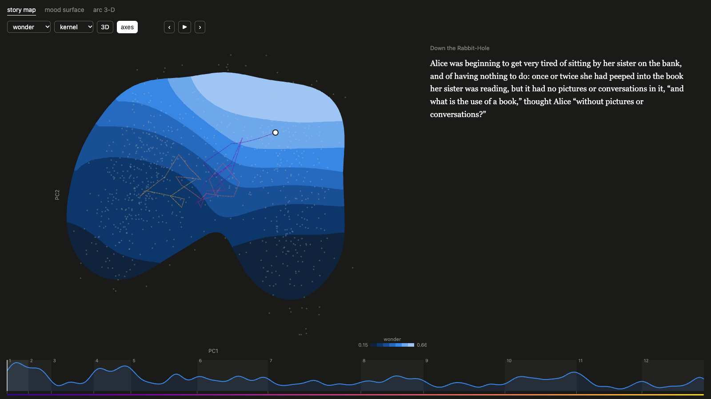
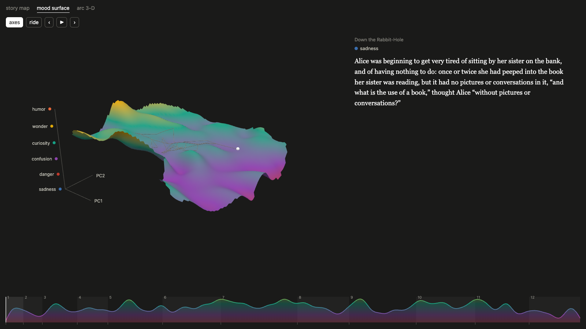
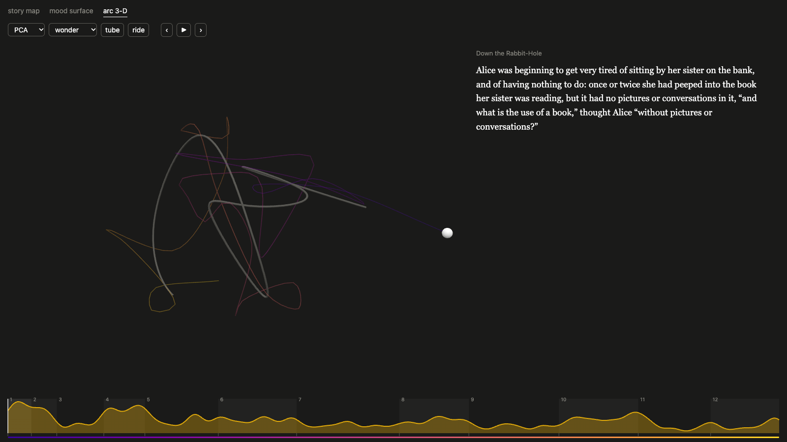

# Narrative Tension Field

A book read as geometry: every paragraph is a point in an embedding space with
six emotion scores, and the story becomes a plane, an emotion landscape over it,
and a curve through it.

## Folder structure

```
books/              the data: text, paragraphs, embeddings (bge-m3, e5-large-v2, qwen3), emotion scores
preprocess/         text -> paragraphs -> embeddings -> emotion scores
geometry/           algorithms: smoothers, meshes, exact geodesics, curve smoothing
common/             shared helpers: output paths, data loading, windows, the interactive page code

projection/         step 1  PCA / UMAP / t-SNE of the paragraphs, and which to trust
surface/            step 2  the emotion landscape z = emotion(PC1, PC2)
  points/             the raw point cloud
  kernel/             kernel smoothing (Gaussian, Epanechnikov, local linear, LOESS)
  bspline/            least-squares B-spline surface
  poisson/            screened Poisson reconstruction
  mood/               six emotions collapsed to one mood height
arc/                step 3  the narrative arc: windows joined in reading order
  curve/              2-D / 3-D arcs and their B-spline fit
  tube/               the arc thickened into an emotion tube
  sweeps/             window, fit, projection and model sweeps
  validation/         is the arc real?
arc_on_surface/     step 4  the arc lifted onto the landscape, and geodesics

docs/figures/       selected outputs
docs/interactive/   the interactive page (open index.html)
```

Each step folder has its own README and writes its results to its own `output/`.

## Pipeline

Every script defaults to one pipeline:

1. **windows** of 40 paragraphs stepping by 20, each the mean of its paragraphs (`common/windows.py`)
2. **plane**: PCA fitted on the paragraphs; the windows are placed in it
3. **arc**: a B-spline fitted through the windows in that plane (`arc/`)
4. **mood**: one value per paragraph on sadness → humor, smoothed into a surface over the plane (`surface/mood/`)
5. **lift**: each window lifted onto the surface, consecutive windows joined by exact geodesics (`surface/mood/geodesic.py`, vertical scale 1)
6. **time**: each point on the route gets a reading position from how far along its leg its shadow is

The alternatives we tried stay as flags or scripts, because each answers its own question:
UMAP / t-SNE and `--pca-fit windows` (other planes), chain-UMAP (`--plane chain_umap`),
kernel / B-spline / Poisson surfaces per emotion (`surface/`), straight legs
(`--legs straight`, the baseline the geodesics are measured against), distance-based
smoothing on the surface (`arc_on_surface/arc_smooth.py`), and height from the text
instead of the surface (`arc_on_surface/narrative_arc_3d.py`).

## Outputs

| | |
|---|---|
|  PCA vs UMAP vs t-SNE |  wonder, kernel surface |
|  B-spline surfaces, six emotions |  mood surface |
|  the arc with its B-spline |  emotion tube |
|  the arc on each emotion surface |  geodesics on the wonder terrain |

More in [docs/figures](docs/figures/README.md), and every figure, folder by folder with its own notes, in the
[Google Drive folder](https://drive.google.com/drive/folders/1e7Bp79dD-s7VlD2bO09AVZsq2iGEcIuq).

## Interactive

Open [`docs/interactive/index.html`](docs/interactive/index.html) in a browser.

| story map | mood surface | arc 3-D |
|---|---|---|
|  |  |  |

## Third-party code

- [geodesic](https://code.google.com/archive/p/geodesic/) (Kirsanov, exact geodesics), in `geometry/geodesic_cpp/`
- [PoissonRecon](https://github.com/mkazhdan/PoissonRecon) (Kazhdan), in `surface/poisson/vendor/`
- [bspline-regression](https://github.com/rstebbing/bspline-regression) (Stebbing), in `arc/vendor/`
- [B-spline-Curves-and-Surfaces](https://github.com/LorenzoPratesi/B-spline-Curves-and-Surfaces), the reference for `surface/bspline/`
