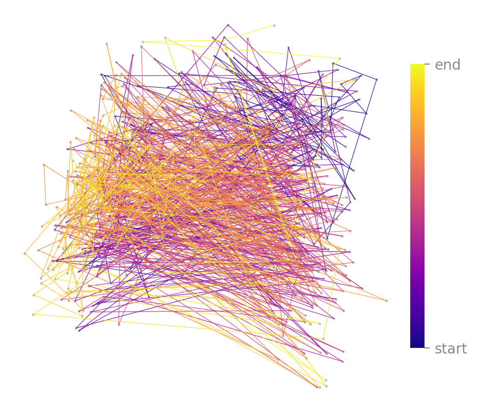
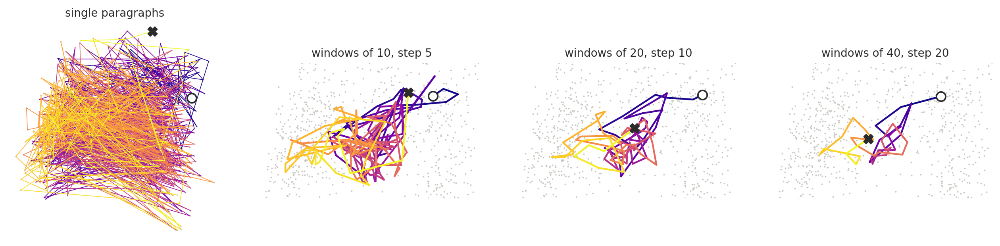
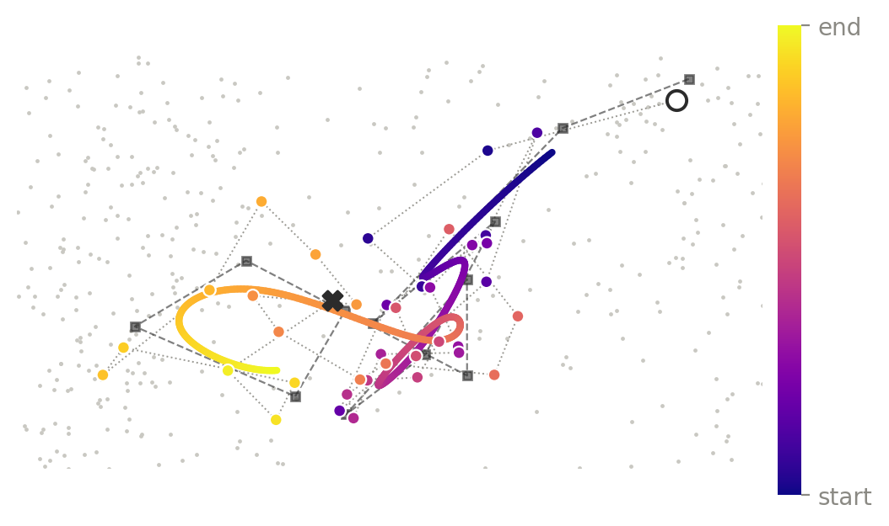
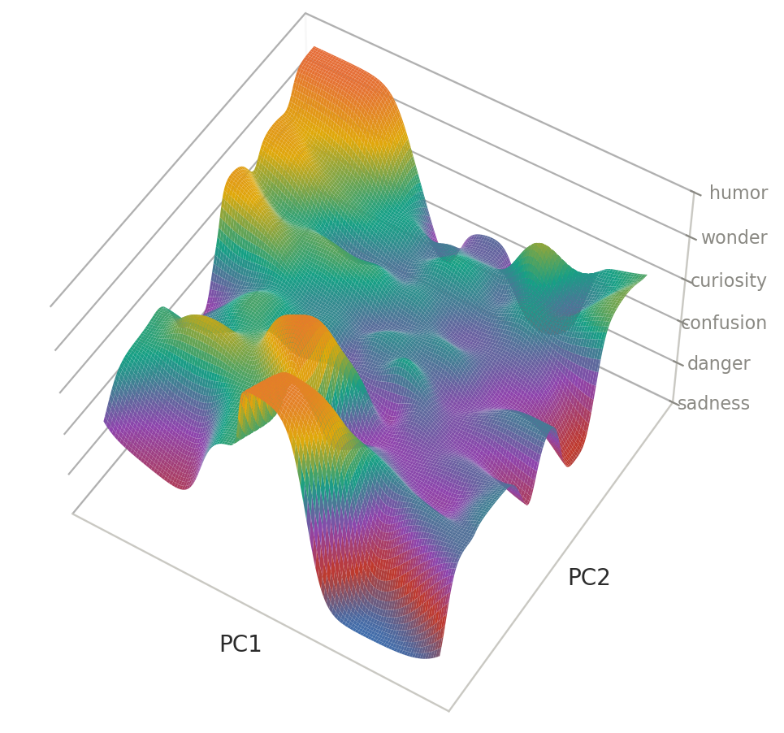
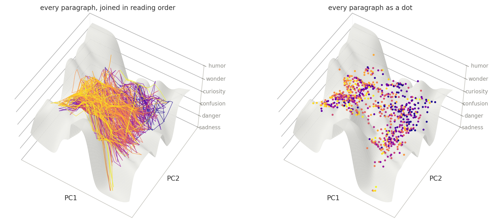
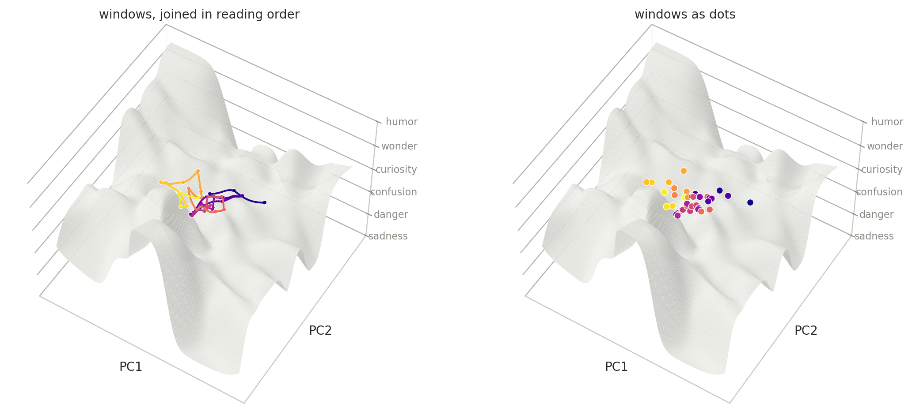
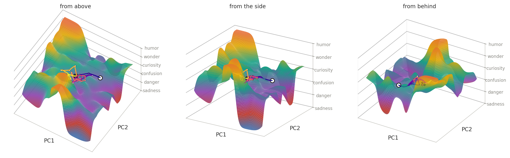
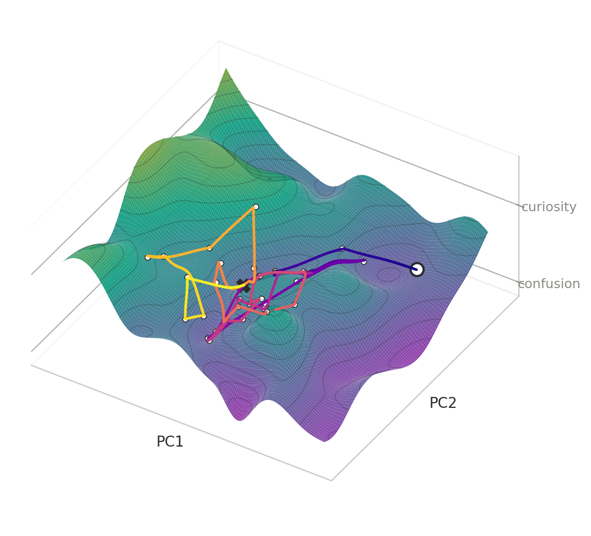
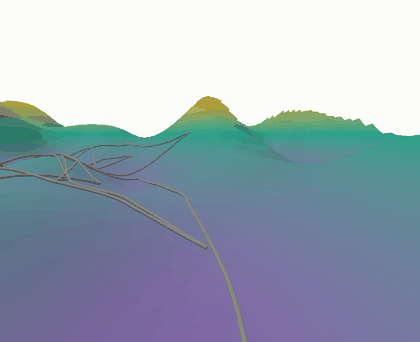
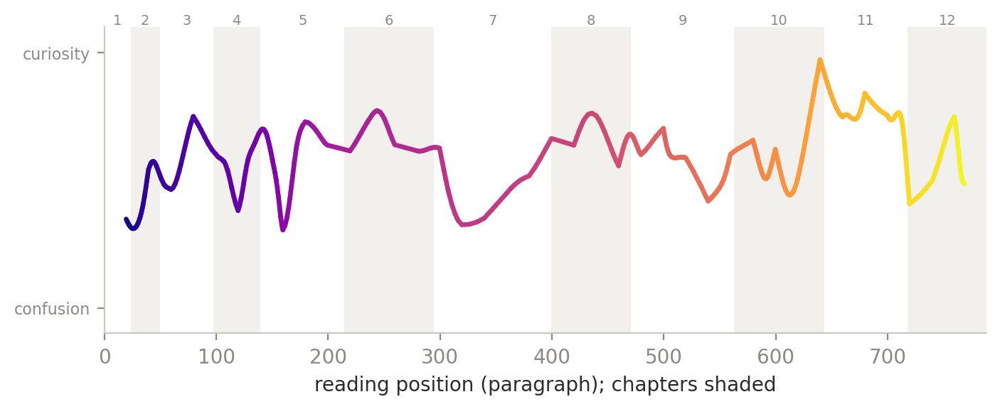

# Following a Story Through Its Own Geometry

Starting from SGI, I had the chance to work on a quite fun project, open to many creative directions and combining geometry processing techniques. Our goal in this project was to explore how narrative embeddings could be turned into **interpretable geometric visualizations**. We had the paragraph-level embeddings for our favorite book; now the question was how to visually represent them in ways that preserve aspects of narrative structure. Of course, this is quite open to perception and quite personal.

The direction I focused on was **temporal order**. Standard embedding visualizations are useful for showing semantic similarity, since passages with similar representations tend to appear near one another, but they usually treat the text as an unordered collection of points. I personally think that for narrative data, temporal structure matters, since a novel (generally) develops and is (commonly) read sequentially, so the order in which passages appear matters independently of whether they are semantically similar.

The approach here therefore asks how semantic geometry and reading order can be visualized together. *Alice’s Adventures in Wonderland* is used as a running example. The text contains 789 paragraphs across 12 chapters, with each paragraph represented by a 1024-dimensional embedding produced using bge-m3.

## Starting from the embedding space

To obtain a view that could be plotted directly, the paragraph embeddings were projected into two dimensions using PCA. If the embedding of paragraph $i$ is $e_i \in \mathbb{R}^{1024}$, the corresponding two-dimensional point is

$$
x_i = V^\top (e_i - \bar e),
$$

where $V$ contains the first two principal directions.

This gives a point cloud in which nearby points correspond, approximately, to paragraphs that are similar in the original embedding space. To introduce temporal structure, the points were then connected according to their position in the book.

*Every paragraph of* Alice *in the PCA plane, connected in reading order. Colour indicates progression through the book.*

This preserves the order of the narrative, i.e. one person can start reading and wander around this embedding space by following that line (technically on paper). However, the result is difficult to interpret visually due to substantial local variation, and it is difficult to see larger-scale movement at the paragraph level.

## Temporal windows

To reduce this local variation, I represented the book using overlapping windows of paragraphs rather than individual paragraphs. For a window of size $w$, moving forward by a stride $s$, the mean position of the paragraphs in each window is

$$
\bar{x}_k = \frac{1}{w} \sum_{i=ks}^{ks+w-1} x_i.
$$

Each point therefore represents a short continuous section of the narrative rather than a single paragraph.

*The narrative trajectory at increasing window sizes.*

Windowing introduces a temporal scale into the visualization. At the paragraph level, the trajectory contains many short-range fluctuations. As the window size increases, these fluctuations are averaged out and broader movements through the embedding space become easier to see.

For the later visualizations, I used windows of 40 paragraphs with a stride of 20. This is not intended as an intrinsic scale of the book, but as a visualization parameter. Smaller windows preserve more local detail, while larger windows emphasize longer-range movement.

This was useful because it showed that temporal structure in narrative embeddings does not necessarily become visible at the level of individual textual units. Some geometric patterns only emerge when the text is considered over a larger interval.

## Fitting a continuous trajectory

Once the windowed trajectory was sufficiently smooth, a cubic B-spline was fitted through the sequence of window positions. The spline gives a continuous approximation of the temporally ordered trajectory,

$$
\gamma(u) = \sum_j B_j(u)c_j,
$$

where $c_j$ are the control points and $B_j(u)$ are the spline basis functions.

*Window positions, their temporal ordering, and the fitted spline.*

I refer to this curve as the **narrative arc** (although here the term is geometric rather than literary). It is a continuous curve through the projected embedding space that follows the broader temporal movement of the text. So, in my interpretation, this corresponds to how the story moves geometrically in a plane as the story develops in time.

At this stage, however, the interpretation is still limited by the PCA coordinates. The trajectory has a visible form, but the axes themselves are not directly meaningful. A movement toward one part of the plane can be described geometrically, but it is difficult to relate that movement to a recognizable narrative property.

## Adding an interpretable scalar field

To make this space more readable, the visualization adds a third dimension based on the emotional character of the text. Each paragraph has scores for six emotions: sadness, danger, confusion, curiosity, wonder, and humor. These emotions are arranged along a single scale from heavier to lighter:

$$
\text{sadness} \;\to\; \text{danger} \;\to\; \text{confusion} \;\to\; \text{curiosity} \;\to\; \text{wonder} \;\to\; \text{humor}.
$$

The raw scores for these emotions are not directly comparable. For example, danger may usually receive low scores across the book, while curiosity may be relatively high almost everywhere. So before comparing them, each emotion score is converted into a percentile relative to that same emotion across the whole book.

If $s_{i,e}$ is the raw score of paragraph $i$ for emotion $e$, we replace it with

$$
p_{i,e} = \operatorname{Percentile}(s_{i,e}),
$$

where the percentile is computed using all paragraphs for that emotion. This means that $p_{i,e}$ tells us how unusually strong emotion $e$ is in paragraph $i$ compared with the rest of the book.

The emotion with the highest percentile determines the main mood category of the paragraph. If we write

$$
e_i^* = \arg\max_e p_{i,e},
$$

then $e_i^*$ is simply the dominant emotion for paragraph $i$.

The six emotions are assigned six consecutive bands along the interval $[0,1]$. The winning emotion determines the band, while the difference between the strongest and second-strongest percentiles determines where the paragraph sits within that band. If one emotion is clearly dominant, the point lies further inside its band; if the top two emotions are close, it lies nearer the lower edge of that band.

This gives every paragraph a single mood value

$$
\mu_i \in [0,1].
$$

So at this stage, each paragraph has two pieces of information: its position $x_i$ in the PCA plane and its mood value $\mu_i$.

The next step is to turn these individual mood values into a smooth field over the whole plane. Mood is initially defined only at the paragraph locations, but the surface needs a value everywhere, including the spaces between points.

For any location $x$ in the PCA plane, the mood is estimated as a weighted average of nearby paragraphs:

$$
m(x) = \frac{\sum_i K_h(x-x_i)\,\mu_i}{\sum_i K_h(x-x_i)}.
$$

Here, $K_h$ is a Gaussian kernel. In practical terms, this means that paragraphs close to $x$ contribute more to the estimate, while paragraphs farther away contribute less.

A Gaussian kernel can be written as

$$
K_h(x-x_i) = \exp\left(-\frac{\lVert x-x_i \rVert^2}{2h^2}\right),
$$

where $h$ controls how local or smooth the averaging is. A smaller $h$ makes the field follow nearby points more closely, while a larger $h$ produces a smoother surface.

The result is a scalar field

$$
m:\mathbb{R}^2 \to [0,1],
$$

which assigns a mood value to every location in the two-dimensional embedding projection.

Instead of showing this field only as colour, the value $m(x)$ is used as height. The flat PCA plane therefore becomes a three-dimensional surface:

$$
(x_1,x_2) \mapsto (x_1,x_2,m(x)).
$$

*The PCA embedding space represented as a surface, with mood used as height.*

So this surface combines two kinds of information: semantic position from the embeddings and emotional information from the paragraph-level scores, allowing movement through the embedding space to be read relative to a quantity with a more direct interpretation. Instead of only saying that the narrative moves from one region of the PCA plane to another, we can also see whether that movement passes through regions associated with heavier or lighter moods.

## Placing the temporal trajectory on the surface

The windowed trajectory and the mood surface are defined over the same PCA plane. For every window position $(x,y)$, the surface therefore gives us a corresponding mood height $m(x,y)$.

The matching point on the surface is simply

$$
(x,y,m(x,y)).
$$

So the window keeps the same $x$ and $y$ coordinates from the PCA projection, while the mood surface provides the third coordinate.

This can be done for both individual paragraphs and the windowed trajectory. At the paragraph level, the path is still quite irregular, so placing all paragraphs on the surface produces the same noisy trajectory as before, now in three dimensions.

*Paragraph positions placed at their corresponding locations on the mood surface.*

The windowed points are more useful because they already capture the smoother, larger-scale movement of the story. Placing them on the surface therefore gives a clearer sequence of positions through the mood landscape.

*Window positions placed at their corresponding locations on the mood surface.*

## Connecting the trajectory with geodesics

Once the window points are placed on the mood surface, the next step is to connect them in temporal order.

A straight line between two points in 3D will generally leave the surface, so the connections are computed as **geodesics**: shortest paths constrained to remain on the surface.

For two points $p$ and $q$ on the surface $S$, the geodesic is the curve

$$
\gamma^* = \arg\min_{\gamma} \int_0^1 \lVert\gamma'(t)\rVert\,dt,
$$

subject to

$$
\gamma(0)=p,\qquad \gamma(1)=q,\qquad \gamma(t)\in S.
$$

In other words, among all curves that stay on the surface and connect $p$ to $q$, the geodesic is the shortest one.

The mood surface is represented computationally as a triangular mesh. The height field $m(x,y)$ is evaluated on a regular grid, and each grid cell is split into two triangles. This gives a piecewise-linear approximation of the surface on which shortest paths can be computed.

Within a single triangle, the surface is flat, so the geodesic is locally a straight line. Across multiple triangles, the path can cross triangle boundaries at arbitrary positions rather than being restricted to the mesh edges.

The implementation uses Danil Kirsanov’s exact geodesic algorithm for triangular meshes, based on the Mitchell–Mount–Papadimitriou method. At a high level, the algorithm propagates shortest-path distance across the mesh from a source point and then traces the shortest route back from the target. The implementation is available here: [ExactGeodesic](https://github.com/jabooth/exactgeodesic), and a Python wrapper is available through [pygeodesic](https://github.com/mhogg/pygeodesic).

For each pair of consecutive temporal windows $p_k$ and $p_{k+1}$, a geodesic path is computed,

$$
\gamma_k^* = \operatorname{Geodesic}(p_k,p_{k+1}).
$$

## The resulting narrative route

Connecting the consecutive windows with geodesics gives a continuous route through the book.

*The temporally ordered narrative windows connected across the mood surface.*

The route combines semantic position, mood, and reading order in a single representation. Horizontal movement reflects changes in the projected embedding space, while vertical movement follows the mood surface.

*The route shown together with contour lines of the mood surface.*

The contour lines make local changes in the surface height easier to see, so the route can be read in terms of both semantic movement and changes in mood.

The same path can also be explored sequentially by moving a camera along it.

*Following the narrative route in reading order.*

Finally, the height of the route can be plotted directly against reading time.

*Mood height along the route over reading time, with chapters indicated.*

This gives a temporal view of the same representation, showing how the mood coordinate changes as the narrative progresses.

The code, visualizations, and interactive version are available in the [neurrative repository](https://github.com/zbegum/neurrative).

Huge thanks to Loiruck Godwin Kambainei, my collaborator, and to our mentor, Congyue Deng, for their feedback, discussions, and sometimes slightly crazy ideas.

It was such a fun project to work on together. We’re still working on **neurrative**, so more is coming. Stay tuned :)
