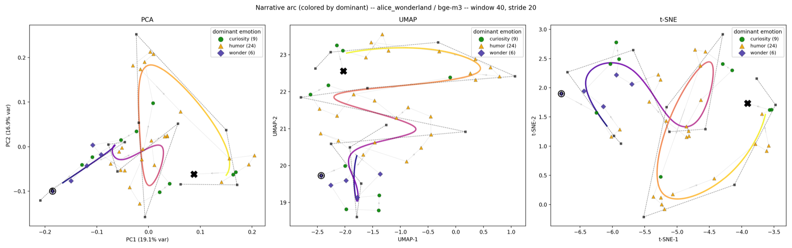

# Selected figures: projections, sweeps and the narrative arc

A curated set of the projection, sweep and narrative-arc figures, committed so
they can be read on GitHub without running anything. Every one is regenerated
by the command under it into `output/` (or `arc/output/`), along with
the same figure for every other book × model. Numbers are for `bge-m3` unless
noted.

## 1. PCA vs UMAP vs t-SNE (paragraph level)

`python projection/embedding_grid.py --book <book> --all-models`, then
`python projection/projection_comparison.py --all`

Columns are neighbourhood scale (local / default / global): UMAP
`n_neighbors` 5 / 15 / 50, t-SNE perplexity 5 / 30 / 100; PCA has no parameter.
Each panel reports trustworthiness *T* (k = 15) and chapter purity, with the
excess over a shuffled-label control.

| book | raw-embedding chapter purity | PCA *T* / purity | UMAP default *T* / purity | t-SNE default *T* / purity |
|---|---|---|---|---|
| Alice | 0.382 | 0.757 / 0.135 | 0.917 / 0.367 | 0.902 / 0.377 |
| Pride and Prejudice | 0.097 | 0.723 / 0.028 | 0.828 / 0.060 | 0.879 / 0.076 |
| Hamlet (acts) | 0.354 | 0.761 / 0.237 | 0.856 / 0.327 | 0.849 / 0.317 |

- **PCA loses the local structure.** Its trustworthiness is the lowest in all
  three books, and for Alice it keeps about a third of the chapter purity that
  the raw embedding has. UMAP and t-SNE keep it almost intact.
- **The scale knob matters less than the method.** Across the three columns,
  UMAP and t-SNE move by a few hundredths.
- **Pride and Prejudice's chapters are not semantic units.** Chapter purity is
  low even in the raw embedding (0.097), so no projection can show chapters
  there.

### Each method's own parameter grid

The 3×3 sweeps behind the table: UMAP over `n_neighbors` × `min_dist`, and
t-SNE over perplexity × learning rate.

## 2. Reading order as graph structure (chain-UMAP)

`python projection/chain_umap.py --book <book> --all-models`

UMAP's fuzzy graph gets extra edges between each paragraph and the next two,
weighted by `beta`. For Alice, going from `beta = 0` (plain UMAP) to `beta = 2`
raises the share of plotted neighbours that are within 5 paragraphs in the book
from 0.10 to 0.26, and chapter purity from 0.38 to 0.68. Trustworthiness falls
from 0.91 to 0.81. There is no principled `beta`; the curve is the result.

## 3. The narrative arc under different projections and windows

`cd arc && python sweep.py --all-books --all-models`, and
`python grid_3d.py --all-books --all-models`

**Projection parameters** (window 20, stride 10: 78 windows). t-SNE perplexity
5–40 and UMAP `n_neighbors` 5–40, with how far the layout moves between seeds
(`seed_disp`) and how well a B-spline follows the windows in order.

**Window size.** Rows are size:stride. The share of variance that 2-D PCA
captures grows with the window, from 21% at 10:5 to 49% at 80:40. The heavily
overlapping 40:5 row is there as a warning: UMAP and t-SNE trustworthiness
reach 0.998 and 0.9995 only because adjacent windows share most of their
paragraphs.

**Embedding model.** The arc's geometry barely depends on the model: the
Spearman correlation between window-to-window distances is 0.94
(bge-m3 vs e5), 0.94 (bge-m3 vs qwen3) and 0.92 (e5 vs qwen3).

**3-D arc and its flat views** for four window sizes, PCA and UMAP. A loop that
seems to cross itself in one flat view can be checked against the other two.

## 4. The 2-D arc and its B-spline fit

`cd arc && python arc_2d.py --all-books --all-models --fit --show-control`
(and `arc_3d.py` with the same flags)

Windows of 40 paragraphs stepping by 20, joined in reading order: **O** is the
opening, **X** the ending, and the color is reading position. The thick curve is
a cubic uniform B-spline fitted with `bspline-regression`
(`arc/narrative_arc/curves.py`), which optimises the control points
(the dashed polygon) and each window's position on the curve at the same time.
The fit starts from reading order, so a path that crosses itself keeps its two
passes apart. Defaults: 12 control points, `lambda` 0.1.

The same arc colored by each window's dominant emotion:

**How tight should the curve be?** Columns are the number of control points,
rows are `lambda`, the penalty on the distance between neighbouring control
points. Each panel gives the residual, the share of consecutive windows that
land out of order on the curve, and the gap between the curve's ends and the
first and last windows. With few control points or a large `lambda` the curve
shrinks and misses both the loops and the ends (6 control points at
`lambda` 10: residual 0.60, end gap 0.83). With many control points and a small
`lambda` it follows every window (16 control points at `lambda` 0.01: residual
0.06, 18% out of order, end gap 0.05) but starts to loop. The default sits in
between.

**In 3-D** the third principal component (10.7% of the variance for Alice)
separates passes that overlap in the plane. The fitter is the same one, since
bspline-regression works in any dimension.

The other two books, colored by reading position:

